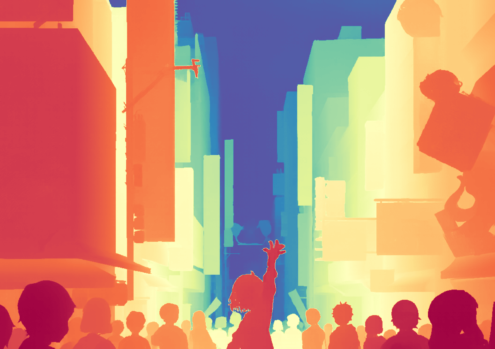
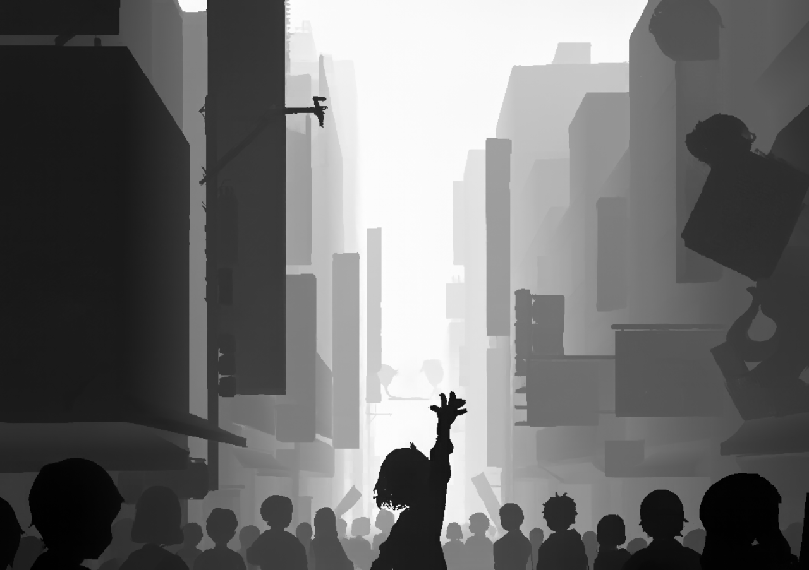

# 🌌 3D Pixel Particle Reconstruction (Vue 3 + Three.js)

[English](./README_EN.md) | [中文](./README.md)

一个基于 **Vue 3** 和 **Three.js** 的高性能 WebGL 粒子特效实验项目。该项目能够将普通的 RGB 图像转化为数万个 3D 粒子，并支持通过 **深度图 (Depth Map)** 重构 2.5D/3D 浮雕模型，以此模拟点云扫描效果。

<table>
  <tr>
    <td>
      
    </td>
    <td>
      
    </td>
  </tr>
  <tr>
    <td>
      
    </td>
    <td>
      
    </td>
  </tr>
</table>

----

<table>
  <tr>
    <td style="vertical-align: middle;"
      <a></a>
    </td>
    <td style="vertical-align: middle;">
      <b>示例图作者：</b>
      <a href="https://www.nemupan.com" target="_blank" style="color:#f2a3b3">
        nemupan
      </a>
    </td>
    <td style="vertical-align: middle;"
      <a></a>
    </td>
    <td style="vertical-align: middle;">
      <b>深度估计模型：</b>
      <a href="https://github.com/Haruko386/ApDepth" target="_blank" style="color:#f2a3b3">
        ApDepth
      </a>
    </td>
    </tr>
</table>

## ✨ 核心特点

* **🧊 深度重构 (Depth Reconstruction)**：支持上传单通道深度图（Depth Map），基于其灰度值将 2D 图像实时转化为 3D 点云模型。
* **🎞️ GIF 动图支持**：内置 GIF 解析器，支持上传 GIF 动图，粒子会随每一帧动画实时更新颜色。


## 🛠️ 项目环境

* **Frontend Framework**: Vue 3 (Composition API)
* **3D Engine**: Three.js
* **Build Tool**: Vite
* **Shader Language**: GLSL (Vertex & Fragment Shaders)
* **Utils**: gifuct-js (GIF parsing)

## 🚀 环境配置

### 1. 环境要求

* Node.js > 22.0
* npm 或 yarn

### 2. 安装依赖

```bash
git clone https://github.com/Haruko386-UnOffical/3D_Pixel_Particle_Reconstruction.git
cd 3D_Pixel_Particle_Reconstruction
npm install
```

### 3. 启动开发服务器

```bash
npm run dev
```

访问 `http://localhost:5173`即可

--------

## 📖 使用指南

### 基础操作

1. **上传图片**：点击 **`UPLOAD IMAGE`**，选择一张图片。
2. **视角控制**：
    * **左键拖拽**：旋转模型。
    * **右键拖拽**：平移视角。
    * **滚轮滚动**：缩放视图。


### 3D 深度模式

要使用“深度点云”效果，你需要：一张原图，一张对应的深度图。

1. 先上传 **RGB 原图**。
2. 点击 **`UPLOAD DEPTH`** 按钮上传深度图（必须是单通道深度图）。

3. 上传成功后，UI 会显示 `3D MODE`，粒子将自动根据深度渲染在指定位置。

## 🧩 项目结构

```
src/
├── assets/             # 静态资源 (默认演示图)
├── components/
│   ├── PixelImage.vue  # [核心] 主场景组件 (Three.js 逻辑, Shader, UI)
│   └── PresetSelector.vue # 预设图片选择器组件
├── utils/
│   └── gifLoader.js    # GIF 解析与帧处理工具
├── App.vue             # 根组件
└── main.js             # 入口文件

```

## 🤝 贡献与反馈

如果你有更好的 Shader 算法或优化建议，欢迎提交 `Issue` 或 `PR` ！

## 📄 License

> [!CAUTION]
>
> 本项目基于 MIT License © 2026 Dimon0000000

